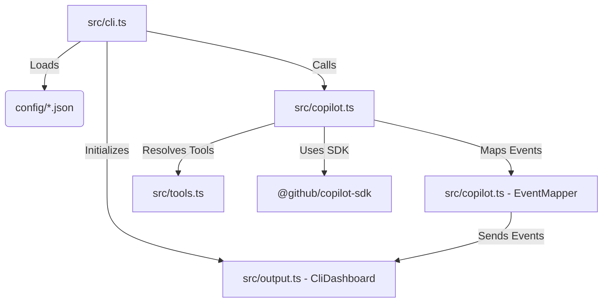
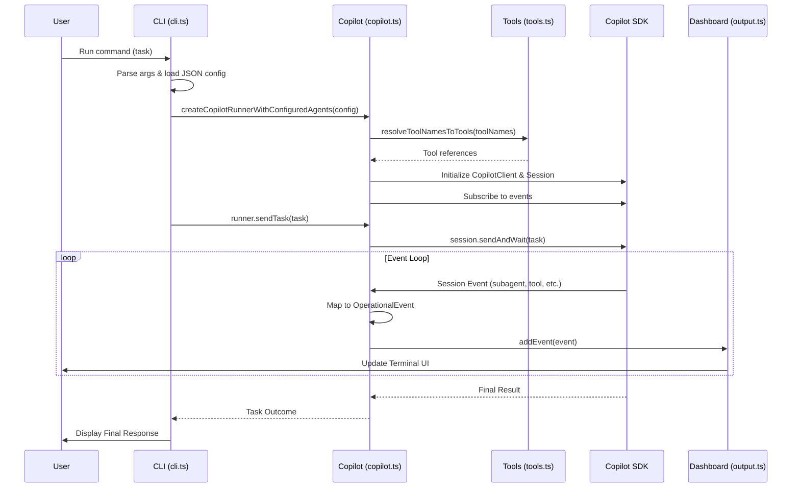

# CLI Architecture

This document describes the architecture and flow of the Omni CLI.

## Component Overview

The following diagram shows the main components and their relationships.

## General CLI Flow (Sequence)

The following sequence diagram illustrates the lifecycle of a typical task execution.

