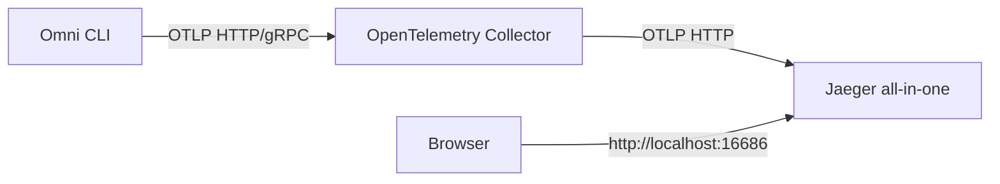

# Telemetry and trace visualization

This project supports OpenTelemetry export through the Copilot SDK `telemetry` client option.

## Architecture



## 1) Start visualization stack

```bash
docker compose -f docker-compose.telemetry.yml up -d
```

This starts:
- OpenTelemetry Collector listening on `localhost:4317` (gRPC) and `localhost:4318` (HTTP)
- Jaeger UI on `http://localhost:16686`

## 2) Run Omni with telemetry enabled

One-shot example:

```bash
pnpm start --agent-file .\config\agent1.json --telemetry-otlp-endpoint http://localhost:4318 --telemetry-source-name omni-cli --telemetry-capture-content "Tell me a joke"
```

Interactive example:

```bash
pnpm start --agent-file .\config\agent1.json --interactive --telemetry-otlp-endpoint http://localhost:4318 --telemetry-source-name omni-cli --telemetry-capture-content
```

File exporter example:

```bash
pnpm start --agent-file .\config\agent1.json --telemetry-file-path .\dist\omni-traces.jsonl --telemetry-exporter-type file "Tell me a joke"
```

## 3) View traces

1. Open `http://localhost:16686`.
2. Choose service `omni-cli` (or your configured `--telemetry-source-name` value).
3. Click **Find Traces**.

`--telemetry-source-name` is now mapped to both OpenTelemetry source scope and `service.name`, so it appears as the Jaeger service label.

## Troubleshooting

- **No traces in Jaeger**: confirm collector is up and Omni uses `--telemetry-otlp-endpoint http://localhost:4318`.
- **Only `jaeger-all-in-one` appears**: run one Omni request after startup and refresh service list; Jaeger service labels are based on `service.name` (set from `--telemetry-source-name`).
- **Port already in use**: free `4317`, `4318`, or `16686`, then restart compose.
- **Empty service list**: run at least one Omni task after stack startup.
- **Privacy warning**: `--telemetry-capture-content` includes prompts/responses in spans; use only where this is acceptable.
